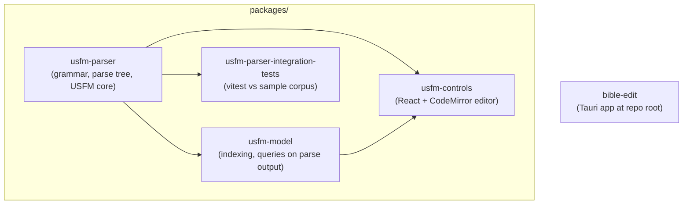

# UsfmTools

TypeScript libraries and UI for working with [USFM](https://ubsicap.github.io/usfm/) (Unified Standard Format Markers), a plain-text convention used for Bible translation files.

## Architecture

Consumable libraries live under `packages/` and are wired together with npm `file:` dependencies. The **`bible-edit`** application is a Tauri desktop shell at the **repository root** (not under `packages/`), since it is an end-product app rather than a shared library package. Build this repository **bottom-up**: the parser is the foundation; the model and UI layers sit on top.



| Name | Role |
|--------|------|
| **usfm-parser** | Parses USFM source into structured data; ships ESM and CJS bundles (`dist/`). |
| **usfm-model** | View models (for example `ViewModels.Publication` / `PublicationViewModel`), publication-style HTML rendering via **`renderPreviewHtml`**, standard USFM **book identifier** metadata and **`buildUsfmBookPickerGroups`** (OT, NT, other standard, and non-standard entries including optional or missing `\\id`), **`listChapterNumbersFromBook`** for ordered `\\c` labels on a parsed book, plus re-exports of **`parse`**. |
| **usfm-controls** | React controls: **`UsfmEditor`** (CodeMirror), **`UsfmPreview`** (publication-style HTML), **`UsfmBookPicker`** (OT/NT grids plus standard-other and non-standard book lists from in-memory USFM), **`ChapterPicker`** (equal-width chapter buttons for one parsed book), and the async USFM language service. Depends on the parser and model. |
| **usfm-parser-integration-tests** | Longer-running checks against the parser; **no** `build` script, only `npm test`. |
| **bible-edit** | Tauri + React + Tailwind desktop shell for a planned USFM Bible editor (lives at repo root). See **`bible-edit/README.md`** for build, run, tests, and design notes. |

The **`Plan/`** directory holds Obsidian-style planning notes and is not part of the build.

## Requirements

- **Node.js 20+** and npm

## Build everything

From the repository root:

```bash
./build.sh
```

This runs `npm install` and `npm run build` (when defined) in order: parser, model, controls, integration tests under `packages/`, then **`bible-edit/`** at the repository root (frontend `dist/` only; native Tauri bundles use `npm run tauri build` inside that directory).

### Build troubleshooting

If **`usfm-model`** fails during the **DTS** step with **`Cannot find module '@usfm-tools/parser'`**, build **usfm-parser** first so `packages/usfm-parser/dist/` (including `index.d.ts`) exists. Running **`./build.sh`** from the repo root does that in the correct order. If you build by hand, run `npm run build` in `packages/usfm-parser`, then `npm install` and `npm run build` in `packages/usfm-model`.

#### Stale workspace deps after editing another package

The packages depend on each other through npm `file:` paths (e.g. `"@usfm-tools/model": "file:../usfm-model"`). npm **copies** these into `node_modules/@usfm-tools/<pkg>` on first install and then leaves them alone — `npm install` will **not** refresh them when their `dist/` changes, because the version in `package.json` hasn't moved. The symptom: you change `usfm-model` and run `npm run build`, but Storybook (or tests) in `usfm-controls` keeps serving the **old** `dist/`.

Storybook makes this worse: its Vite dep optimizer pre-bundles `@usfm-tools/*` into `node_modules/.cache/storybook/.../sb-vite/deps/` keyed on the dep path, not its contents. After a refresh you'll see errors like **`does not provide an export named 'renderPreviewHtml'`** until that cache is cleared too.

Two ways to fix it:

1. **Use the root build script.** `./build.sh` now purges both `node_modules/@usfm-tools/*` and `node_modules/.cache/` in each package before installing, so the latest `dist/` is copied in and Vite re-pre-bundles on the next Storybook start.
2. **Manual purge** in the downstream package, then reinstall:

   ```bash
   cd packages/usfm-controls
   rm -rf node_modules/@usfm-tools node_modules/.cache
   npm install
   ```

Restart Storybook / dev servers after either fix so they read the new files.

## Run usfm-controls

**usfm-controls** is a **library** (React components), not a standalone server. The usual way to try it locally is **Storybook**, which hosts the `UsfmEditor` and related stories.

1. From the repository root, run **`./build.sh`** once (or manually build **`packages/usfm-parser`** and **`packages/usfm-model`**). Storybook’s Vite setup resolves those packages from their **`dist/`** output; skipping this step often causes missing-module errors.
2. **`cd packages/usfm-controls`**
3. **`npm install`**
4. **`npm run storybook`**
5. Open **http://localhost:6006/** in a browser. If that port is busy, Storybook prompts for another port on the terminal.

Other useful scripts in that package: **`npm run dev`** (watch mode rebuild of the library with tsup), **`npm run build-storybook`** (static Storybook build under `storybook-static/`), and the usual test, lint, and typecheck commands in the table below. Stories include **Controls / UsfmPreview / With Editor** for a live editor plus preview pane.

### Per-package commands

Useful when you are developing a single area. Run these from the package directory (for example `packages/usfm-parser/`), or from **`bible-edit/`** at the repository root for the desktop app.

| Task | Command |
|------|---------|
| Install | `npm install` |
| Build | `npm run build` |
| Test | `npm test` |
| Lint | `npm run lint` |
| Typecheck | `npm run typecheck` |

## Contributing

See **`AGENTS.md`** for tooling notes used in automated environments (bundler output, test stack, and similar).
