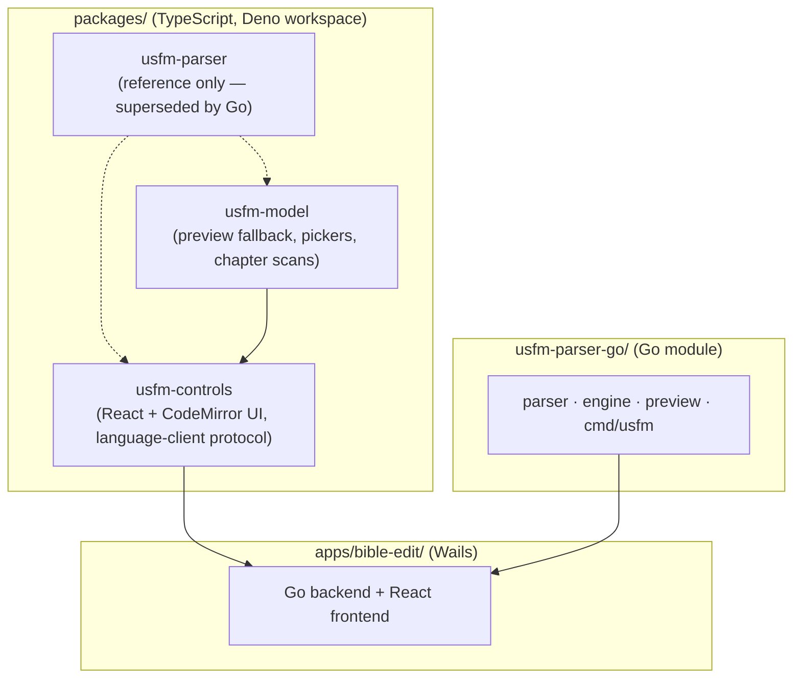

# UsfmTools

Libraries, an editing engine, and a desktop editor for working with [USFM](https://ubsicap.github.io/usfm/) (Unified Standard Format Markers), a plain-text convention used for Bible translation files. The UI layer is TypeScript (Deno workspace); parsing and language analysis run in Go.

## Architecture

Three top-level areas:

- **`packages/`** — the TypeScript libraries, wired together as a **Deno workspace** (root `deno.json`)
- **`usfm-parser-go/`** — the **Go module**: USFM parser, LSP-like editing engine, and standalone CLI (see its [README](usfm-parser-go/README.md))
- **`apps/bible-edit/`** — the **BibleEdit** desktop editor ([Wails](https://wails.io/)): a Go backend embedding the engine, hosting the React `UsfmShell` frontend (see its [README](apps/bible-edit/README.md))



| Name | Role |
|--------|------|
| **usfm-parser-go** | The USFM parser and analysis engine: error-tolerant parsing, diagnostics, syntax classification, completions, book/chapter structure, and preview HTML rendering — as a Go library, an asynchronous LSP-like engine, and the `usfm` CLI (`check`, `parse`). Verified byte-for-byte against the TS parser across the Berean corpus. |
| **usfm-controls** | React controls: **`UsfmEditor`**, **`UsfmPreview`**, **`UsfmPane`**, **`UsfmWorkspace`**, **`UsfmShell`**, pickers — plus the **`UsfmLanguageClient`** protocol (LSP-like document sync + feature requests) they consume. In BibleEdit the client is backed by the Go engine; standalone/stories fall back to an in-process TS client. |
| **usfm-model** | View models and helpers still used by the UI layer: publication preview rendering (**`renderPreviewHtml`**, the TS fallback for `UsfmPreview`), standard USFM **book identifier** metadata, picker grouping, and regex-based chapter/marker scans. |
| **usfm-parser** | ⚠️ **Reference only.** The original TypeScript parser, superseded by `usfm-parser-go` and excluded from the build/check/test pipeline. Kept while remaining `usfm-model`/fallback imports resolve against it. |
| **usfm-parser-integration-tests** | The TS parser's Berean-corpus tests — reference only, excluded from the pipeline (the corpus tests were ported to `usfm-parser-go/integration/`). |
| **apps/bible-edit** | Desktop USFM editor. The Go side binds the engine (`UsfmService`) and enforces file-access rules; the frontend implements the language-client protocol over the Wails bindings, forwarding CodeMirror change sets as incremental updates and receiving pushed diagnostics. |

Supporting directories: **`bibles/`** holds the Berean Standard Bible USFM corpus used by tests and differential verification; **`Plan/`** holds Obsidian-style planning notes (not part of the build); **`todo.md`** tracks in-flight work.

## Requirements

- **[Deno 2+](https://docs.deno.com/runtime/getting_started/installation/)** — TypeScript packages
- **[Go 1.22+](https://go.dev/dl/)** — `usfm-parser-go` and the BibleEdit backend
- Building the desktop app additionally needs the **[Wails CLI](https://wails.io/docs/gettingstarted/installation)** v2, **npm** (frontend bundle), and on Linux **WebKitGTK** (4.0 or 4.1)

## Build and test everything

From the repository root:

```bash
./build.sh
```

This type-checks and tests the active Deno packages (`usfm-model`, `usfm-controls`), then runs `go vet ./...` and `go test ./...` in `usfm-parser-go/`. (`usfm-parser` and its integration tests are reference-only and skipped.)

Workspace tasks directly:

```bash
deno task check   # type-check usfm-model + usfm-controls
deno task test    # run their test suites
deno task lint    # lint packages/
```

Go module directly:

```bash
cd usfm-parser-go
go vet ./... && go test ./...
go test -race ./engine/    # engine concurrency suite
go build ./cmd/usfm        # the standalone CLI
```

Desktop app:

```bash
cd apps/bible-edit
./build.sh                 # npm install + vite build + wails build
```

## Per-package commands

Run from a package directory (for example `packages/usfm-controls/`):

| Task | Command |
|------|---------|
| Type-check | `deno task check` |
| Test | `deno task test` |
| Lint | `deno task lint` |

### Component stories (usfm-controls)

Interactive component development uses [Ladle](https://ladle.dev/), run via Deno from `packages/usfm-controls/`:

```bash
cd packages/usfm-controls
deno task ladle        # dev server (default http://localhost:61000/)
deno task ladle:build  # static build to build/
```

Stories live next to components as `*.stories.tsx`. The first run may download npm dependencies into a workspace `node_modules/` directory (gitignored). Stories run without the Go engine — components fall back to the in-process TS language client.

## Contributing

See **`AGENTS.md`** for tooling notes used in automated environments, and **`usfm-parser-go/README.md`** for the engine architecture and protocol.
