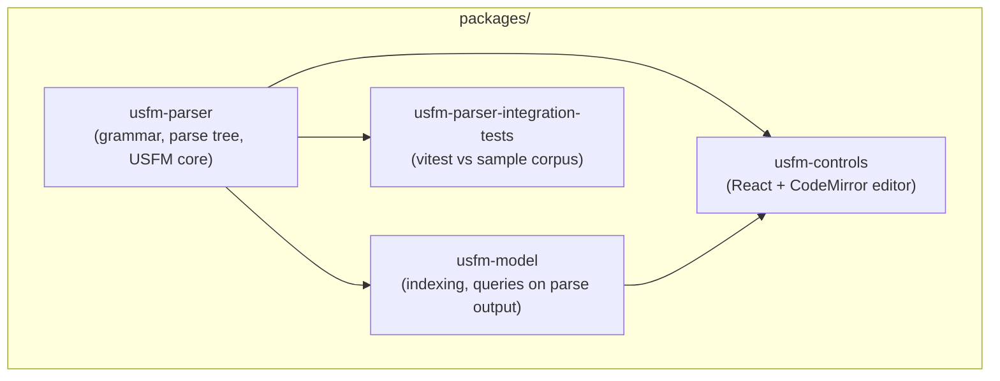

# UsfmTools

TypeScript libraries and UI for working with [USFM](https://ubsicap.github.io/usfm/) (Unified Standard Format Markers), a plain-text convention used for Bible translation files.

## Architecture

Packages live under `packages/` and are wired together with npm `file:` dependencies. Build this repository **bottom-up**: the parser is the foundation; the model and UI layers sit on top.



| Package | Role |
|--------|------|
| **usfm-parser** | Parses USFM source into structured data; ships ESM and CJS bundles (`dist/`). |
| **usfm-model** | Higher-level scripture-oriented helpers built on the parser. |
| **usfm-controls** | React controls for editing USFM (syntax highlighting, diagnostics, autocomplete). Depends on the parser and model. |
| **usfm-parser-integration-tests** | Longer-running checks against the parser; **no** `build` script, only `npm test`. |

The **`Plan/`** directory holds Obsidian-style planning notes and is not part of the build.

## Requirements

- **Node.js 20+** and npm

## Build everything

From the repository root:

```bash
./build.sh
```

This runs `npm install` and `npm run build` (when defined) for each package in order: parser, model, controls, then integration tests (install only).

### Per-package commands

Useful when you are developing a single area. Run these from the package directory (for example `packages/usfm-parser/`).

| Task | Command |
|------|---------|
| Install | `npm install` |
| Build | `npm run build` |
| Test | `npm test` |
| Lint | `npm run lint` |
| Typecheck | `npm run typecheck` |

**usfm-controls** also provides `npm run storybook` for local UI development; Storybook expects the parser and model packages to be built first so Vite can resolve `@usfm-tools/parser` and `@usfm-tools/model`.

## Contributing

See **`AGENTS.md`** for tooling notes used in automated environments (bundler output, test stack, and similar).
