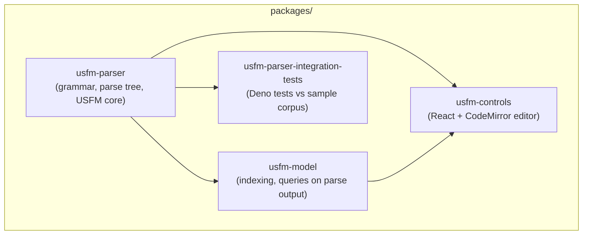

# UsfmTools

TypeScript libraries and UI for working with [USFM](https://ubsicap.github.io/usfm/) (Unified Standard Format Markers), a plain-text convention used for Bible translation files.

## Architecture

Consumable libraries live under `packages/` as a **Deno workspace** (see root `deno.json`). Build and test **bottom-up**: the parser is the foundation; the model and UI layers sit on top.



| Name | Role |
|--------|------|
| **usfm-parser** | Parses USFM source into structured data; exports TypeScript from `src/`. |
| **usfm-model** | View models (for example `ViewModels.Publication` / `PublicationViewModel`), publication-style HTML rendering via **`renderPreviewHtml`**, standard USFM **book identifier** metadata and **`buildUsfmBookPickerGroups`**, **`listChapterNumbersFromBook`**, plus re-exports of **`parse`**. |
| **usfm-controls** | React controls: **`UsfmEditor`** (CodeMirror, with find/replace via **Ctrl+F** / **Ctrl+H**), **`UsfmPreview`**, **`UsfmBookPicker`**, **`ChapterPicker`**, and the async USFM language service. Depends on the parser and model. |
| **usfm-parser-integration-tests** | Longer-running checks against the parser; tests only (no separate check task). |

The **`Plan/`** directory holds Obsidian-style planning notes and is not part of the build.

## Requirements

- **[Deno 2+](https://docs.deno.com/runtime/getting_started/installation/)**

## Build and test everything

From the repository root:

```bash
./build.sh
```

This runs `deno task check` on parser, model, and controls, then `deno task test` on all four workspace packages in dependency order.

You can also use workspace tasks directly:

```bash
deno task check   # type-check libraries
deno task test    # run all package tests
deno task lint    # lint packages/
```

## Per-package commands

Run from a package directory (for example `packages/usfm-parser/`):

| Task | Command |
|------|---------|
| Type-check | `deno task check` |
| Test | `deno task test` |
| Lint | `deno task lint` |

## Contributing

See **`AGENTS.md`** for tooling notes used in automated environments.
